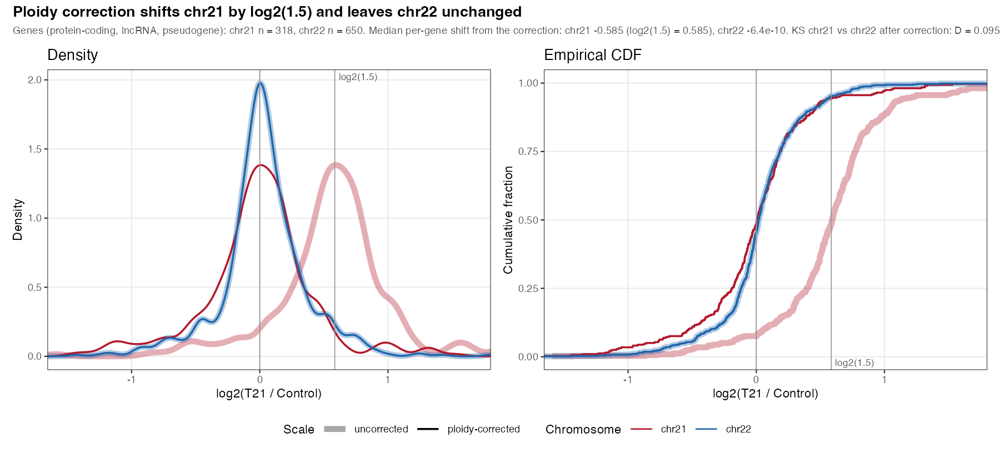

## Results {.page_break_before}

### Most chromosome 21 genes show a gene-dosage-dependent increase in expression
To determine whether HSA21 genes in whole blood from people with T21 are expressed in proportion to their extra copy, we compared transcript levels between T21 and D21 individuals before and after ploidy correction.

The HTP RNA-seq cohort consisted of 399 individuals, 304 with DS and 95 euploid controls.
Filtering removed samples missing cell-type composition (22) or BMI metadata (12), and samples with mosaic karyotypes for HSA21 (9).
We also removed samples from people with DS who did not have WGS data (2).
We compared whole blood bulk RNA transcript counts between 274 T21 samples and 80 D21 samples, a total of 354 samples.
People with DS had significantly higher body mass index (BMI) than those with euploid karyotypes (Table {@tbl:cohort-characteristics}).
Additionally, the D21 individuals were significantly older than those with T21 karyotypes.
The sex composition did not significantly differ by karyotype.
Though processed at the same facility, the samples were collected at 3 different locations.

| Characteristic | Level | T21 (n=274) | Control (n=80) |  P-value |
|---|---|---|---|---|
| Age at visit (years) | median [IQR] | 24.0 [16.1-32.5] | 27.4 [16.3-37.8] |  0.0802 |
| BMI | median [IQR] | 27.6 [23.1-33.4] | 24.2 [20.4-27.4] |  < 0.0001 |
| Sex | Female | 124 (45.3%) | 45 (56.2%) | 0.0982 |
| | Male | 150 (54.7%) | 35 (43.8%) | |
| Sample source | Local | 81 (29.6%) | 54 (67.5%) | 0.0005 |
| | NDSC2018 | 81 (29.6%) | 7 (8.8%) | |
| | NDSC2019 | 112 (40.9%) | 19 (23.8%) | |

Table: Analysis cohort assembly and baseline characteristics, stratified by karyotype. {#tbl:cohort-characteristics}

We assessed the effects of ploidy correction on the differential expression analysis.
Of the 318 HSA21 genes, 153 had baseMean coverage $\ge$ 30 and were not in high-repeat regions.
Before ploidy correction, statistically significant (adjusted p < 0.01) fold changes $\ge$ 1.33 were observed in 76% (117) of the HSA21 genes passing thresholds.
After ploidy correction, 8.5% (13) of HSA21 genes had significant fold changes (either up or down) (Table {@tbl:chr21-classification} and Figures {@fig:flow-map}A, {@fig:volcano-chr21}, {@fig:s2-volcano-all}).
Per-gene statistics for all 318 genes are given in Supplementary Table S1.
The magnitude of the correction matches the ploidy expectation.
Across the 318 HSA21 genes, the median fold change shifted from 0.601 (~log2(1.5) = 0.585) before correction to 0.016 after correction.
Chromosome 22 showed no shift, confirming that the correction is specific to HSA21 (Figure {@fig:ploidy-correction}).

<!-- Marc: do we need the titles and subtitles in the plots or we can move the information to the captions? -->
{#fig:volcano-chr21 width="90%"}

{#fig:ploidy-correction width="90%"}

| Category | Genes |
|---|---|
| Expected dosage | 129 |
| Low expression (not assessable) | 153 |
| High repeats (not assessable) | 12 |
| Near-threshold, not significant | 11 |
| Deviates, higher (DE_high) | 6 |
| Deviates, lower (DE_low) | 7 |

Table: Classification of all 318 targeted HSA21 genes in the primary (adjusted) analysis. {#tbl:chr21-classification}

### *cis*-eQTLs explain variance in most deviating genes
<!-- Marc: deviating genes we defined this in methods but I think a sentence here for the reader like We defined deviating genes as those whose expression differed from the expected 1.5-fold dosage effect by at least 33% (adjusted p < 0.01). -->
To assess potential genetic effects explaining deviating genes, we compared the ploidy-aware genotypes and covariate-adjusted whole blood gene expression of 274 people with DS to common whole blood eQTLs.
Of the 13 deviating genes, 3 (*ATP5PF*, *RUNX1*, *AP000282.1*) have no GTEx-tested variant nearby.
Of the remaining 10 testable genes, 7 have a detected *cis*-eQTL and 3 do not (*ABCC13*, *BACE2*, *OLIG2*) (Table {@tbl:eqtl-genes}, Figures {@fig:eqtl-dosage} and {@fig:flow-map}A).
All 13 deviating genes sit on the q arm, between 14.2 and 46.3 Mb (Figure {@fig:flow-map}B).
Allele frequencies for every tested variant, in GTEx whole blood, in gnomAD, and in this cohort, are given in Supplementary Table S2.

| Gene | Direction | Tier | *cis*-eQTL status |
|---|---|---|---|
| *ABCC13* | Higher | 1 | Tested, not detected |
| *CBR3* | Higher | 2 | Detected |
| *ADAMTS1* | Higher | 2 | Detected |
| *YBEY* | Higher | 2 | Detected |
| *COL6A2* | Higher | 2 | Detected |
| *ATP5PF* | Higher | 2 | Not testable (no GTEx data) |
| *OLIG2* | Lower | 1 | Tested, not detected |
| *OLIG1* | Lower | 1 | Detected |
| *AP000282.1* | Lower | 1 | Not testable (no GTEx data) |
| *BACE2* | Lower | 2 | Tested, not detected |
| *KCNE1* | Lower | 2 | Detected |
| *PCBP3* | Lower | 2 | Detected |
| *RUNX1* | Lower | 2 | Not testable (no GTEx data) |

Table: *cis*-eQTL status of the 13 genes that deviate from the ploidy expectation in the primary (adjusted) analysis. {#tbl:eqtl-genes}

<!--
Marc: I'd move the text in the boxes into a suppl table, the text is too small; keeping the gene and the GTEx agreement maybe is enough, or commenting this in the results and the table maybe is enough.
Same for fig 4.
Also the genes in the plots should be italic.
-->

![For each of the 10 testable deviating genes, expression against allele copy number in T21, at the variant with the strongest within-cohort signal. Each panel is drawn against the allele that GTEx links to that gene's own direction of deviation. A panel therefore trends up in A, the genes expressed higher than expected, and down in B, the genes expressed lower, when the cohort reproduces the GTEx direction. Panel labels give the minor allele, its frequency, and whether the minor allele runs with or against the deviation.](images/figures/fig_eqtl_dosage_panels.png){#fig:eqtl-dosage width="100%"}

Effect sizes on the deviating genes' best variants were modest (~0.13--0.20 log2-CPM per additional copy of the minor allele).
The effect sizes were similar in magnitude to negative controls (~0.12), which tested variants near an unrelated gene ≥5 Mb away.
The effect sizes were much smaller than positive controls (~0.48), which included the 10 HSA21 genes with the strongest GTEx whole-blood eQTL signal (Figures {@fig:eqtl-effects} and {@fig:s3-eqtl-dosage-controls}).

{#fig:eqtl-effects width="90%"}

{#fig:flow-map width="100%"}

In summary, after ploidy correction most HSA21 genes showed the expected increase with gene dosage.
Only 13 deviated.
Common *cis*-eQTLs may explain some of the variance in 7 of the deviating genes, though the effect sizes are small.
Six genes remain open candidates for a mechanism other than a common *cis*-eQTL: 3 that were tested and showed no genetic signal (*ABCC13*, *BACE2*, *OLIG2*), and 3 that could not be tested for lack of common GTEx data (*ATP5PF*, *RUNX1*, *AP000282.1*) (Figure {@fig:flow-map}).