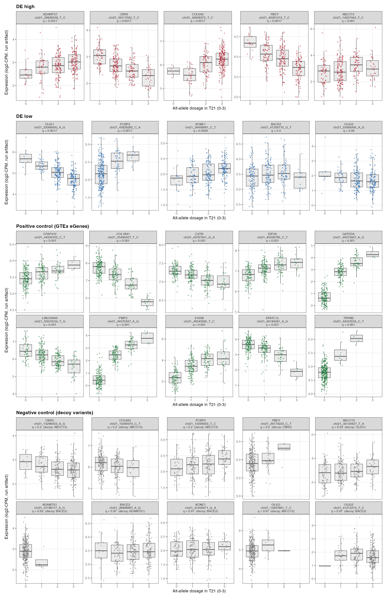
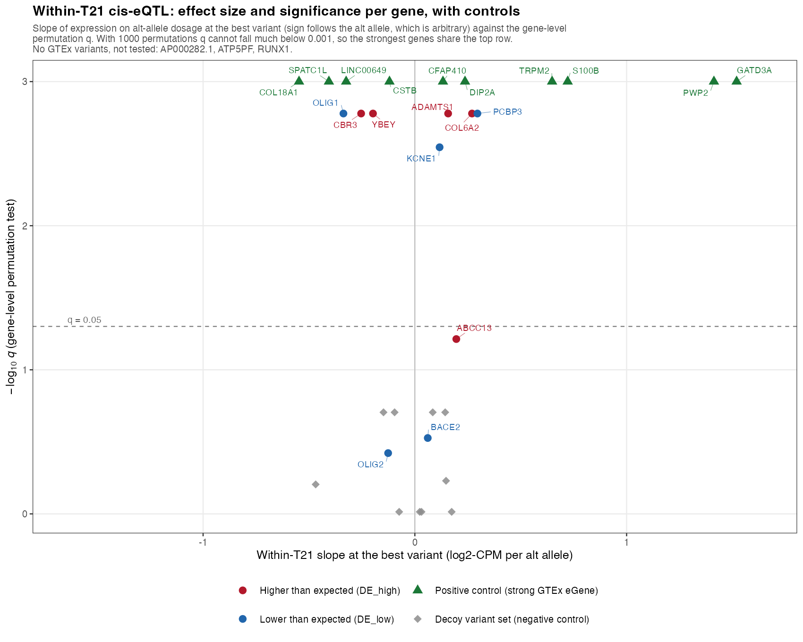
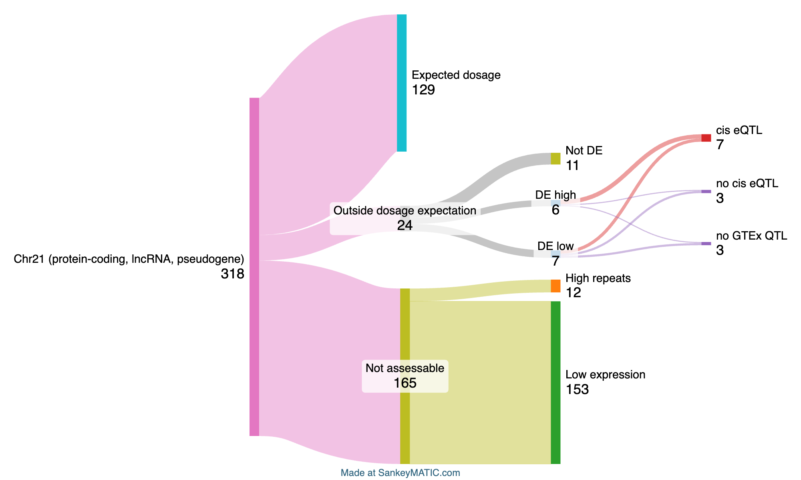

## Results  {.page_break_before}

### Most chromosome 21 genes rise in step with an extra copy of HSA21
The HTP RNAseq cohort consisted of 399 individuals, 304 with DS and 95 euploid controls.
Filtering removed samples missing cell-type composition (22) or BMI metadata (12), and DS samples with mosaic karyotypes (9) or missing WGS data (2).   
Therefore, we compared whole blood bulk RNA transcript counts between 274 T21 samples and 80 D21 samples. 
People with DS had significantly higher Body Mass Index (BMI) and were  those with euploid karyotypes ({@tbl:cohort-characteristics}). 
Additionally, the D21 individuals were significantly older than those with T21 karyotypes. The sex composition did not significantly differ by Karyotype. The samples were collected at 3 different time points. Time point was significantly associated with karyotype. 

| Characteristic | Level | T21 (n=274) | Control (n=80) |  P-value | 
|---|---|---|---|---|
| Age at visit (years) | median [IQR] | 24.0 [16.1-32.5] | 27.4 [16.3-37.8] |  0.0802 | 
| BMI | median [IQR] | 27.6 [23.1-33.4] | 24.2 [20.4-27.4] |  < 0.0001 | 
| Sex | Female | 124 (45.3%) | 45 (56.2%) | 0.0982 | 
| | Male | 150 (54.7%) | 35 (43.8%) | | 
| Sample source | Local | 81 (29.6%) | 54 (67.5%) | 0.0005 | 
| | NDSC2018 | 81 (29.6%) | 7 (8.8%) | | 
| | NDSC2019 | 112 (40.9%) | 19 (23.8%) | | 

Table: Analysis cohort assembly and baseline characteristics, stratified by karyotype. {#tbl:cohort-characteristics}

We assessed the effects of ploidy-correction on differential expression analysis. 
Of the 318 HSA21 genes, 153 had baseMean coverage $\ge$ 30 and were not in high-repeat regions.
Before ploidy correction, stastically significant (padj < .01) fold changes $\ge$ 1.33 were observed in 76% (117) of the HSA21 genes passing thresholds. 
After ploidy correction, 8.5% (13) of HSA21 genes had significant fold changes (either up or down) ({@tbl:chr21-classification},{@fig:volcano-chr21},{@fig:s2-volcano-all}). 
The magnitude of the correction matches the ploidy expectation. 
Across the 318 HSA21 genes, the median ploidy-corrected fold change shifted from 0.601 (~log2(1.5) = 0.585) before correction to 0.016 after correction. 
Chromosome 22 showed no shift, confirming that the correction is specific to HSA21 ({@fig:ploidy-correction}).

| Category | Genes |
|---|---|
| Expected dosage | 129 |
| Low expression (not assessable) | 153 |
| High repeats (not assessable) | 12 |
| Near-threshold, not significant | 11 |
| Deviates, higher (DE_high) | 6 |
| Deviates, lower (DE_low) | 7 |

Table: Classification of all 318 targeted HSA21 genes in the primary (adjusted) analysis. {#tbl:chr21-classification}

{#fig:volcano-chr21 width="90%"}

{#fig:ploidy-correction width="90%"}

### cis-eQTLs explain variance in most deviating genes
To assess potential genetic effects explaining deviating genes, we compared the ploidy-correct genotypes and covariate adjusted whole blood gene expression in people with DS to common whole blood eQTLs. 
Of the 13 deviating genes, 3 (ATP5PF, RUNX1, AP000282.1) have no GTEx-tested variant nearby. 
Of the remaining 10 testable genes, 7 have a detected cis-eQTL and 3 do not (ABCC13, BACE2, OLIG2) ({@tbl:eqtl-genes}, {fig:eqtl-dosage}).

| Gene | Direction | Tier | cis-eQTL status |
|---|---|---|---|
| ABCC13 | Higher | 1 | Tested, not detected |
| CBR3 | Higher | 2 | Detected |
| ADAMTS1 | Higher | 2 | Detected |
| YBEY | Higher | 2 | Detected |
| COL6A2 | Higher | 2 | Detected |
| ATP5PF | Higher | 2 | Not testable (no GTEx data) |
| OLIG2 | Lower | 1 | Tested, not detected |
| OLIG1 | Lower | 1 | Detected |
| AP000282.1 | Lower | 1 | Not testable (no GTEx data) |
| BACE2 | Lower | 2 | Tested, not detected |
| KCNE1 | Lower | 2 | Detected |
| PCBP3 | Lower | 2 | Detected |
| RUNX1 | Lower | 2 | Not testable (no GTEx data) |

Table: cis-eQTL status of the 13 genes that deviate from the ploidy expectation in the primary (adjusted) analysis. {#tbl:eqtl-genes}

{#fig:eqtl-dosage width="100%"}

Effect sizes on the deviating genes' own best variants were modest (~0.13-0.20 log2-CPM per additional variant copy).
The effect sizes were similar in magnitude to negative controls (~0.12), which tested variants near an unrelated gene ≥5 Mb away.  
The effect sizes were much smaller than positive controls (~0.48), which included the 10 HSA21 genes with the strongest GTEx whole-blood eQTL signal ({@fig:eqtl-effects}, {@fig:s3-eqtl-dosage-controls}).

{#fig:eqtl-effects width="90%"}

Taken together, the majority of deviating genes had common eQTLs that aligned with differences in allele frequencies in the cohort. Six genes remain open candidates for a mechanism other than a common cis-eQTL: 3 were tested and showed no genetic signal (ABCC13, BACE2, OLIG2), and 3 could not be tested for lack of GTEx data (ATP5PF, RUNX1, AP000282.1) ({@fig:sankey}). 

{#fig:sankey width="90%"}