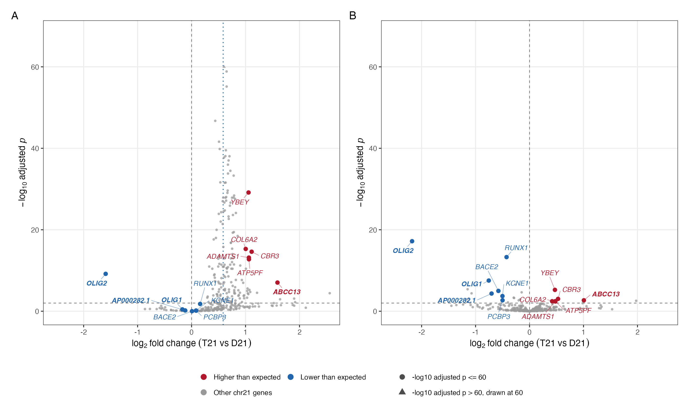
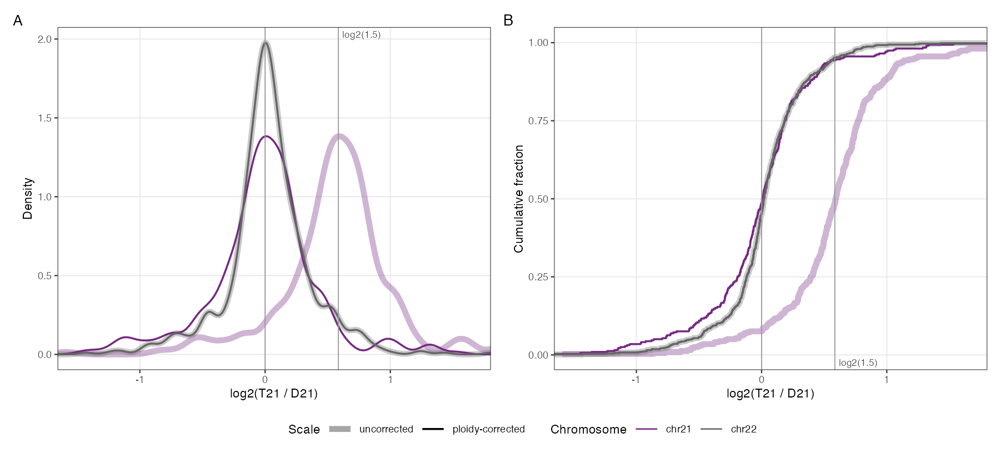

## Results {.page_break_before}

### Most chromosome 21 genes show a gene-dosage-dependent increase in expression
To determine whether HSA21 genes in whole blood from people with T21 are expressed in proportion to their extra copy, we compared transcript levels between T21 and D21 participants before and after ploidy correction.

The HTP RNA-seq cohort consisted of 399 participants, 304 with T21 and 95 D21.
Filtering removed samples missing cell-type composition (22) or BMI metadata (12), and samples with mosaic karyotypes for HSA21 (9).
We also removed samples from T21 participants who did not have WGS data (2).
We compared whole-blood bulk RNA transcript counts between 274 T21 samples and 80 D21 samples, a total of 354 samples.
T21 participants had significantly higher body mass index (BMI) than D21 participants (Table {@tbl:cohort-characteristics}).
The D21 participants were older than the T21 participants (median 27.4 vs. 24.0 years), but the difference was not significant.
The sex composition did not significantly differ by karyotype.
Though processed at the same facility, the samples were collected at 3 different locations.

| Characteristic | Level | T21 (n=274) | D21 (n=80) |  P-value |
|---|---|---|---|---|
| Age at visit (years) | median [IQR] | 24.0 [16.1-32.5] | 27.4 [16.3-37.8] |  0.0802 |
| BMI | median [IQR] | 27.6 [23.1-33.4] | 24.2 [20.4-27.4] |  < 0.0001 |
| Sex | Female | 124 (45.3%) | 45 (56.2%) | 0.0982 |
| | Male | 150 (54.7%) | 35 (43.8%) | |
| Sample source | Local | 81 (29.6%) | 54 (67.5%) | 0.0005 |
| | NDSC2018 | 81 (29.6%) | 7 (8.8%) | |
| | NDSC2019 | 112 (40.9%) | 19 (23.8%) | |

Table: Analysis cohort assembly and baseline characteristics, stratified by karyotype. {#tbl:cohort-characteristics}

We assessed the effects of ploidy correction on the differential expression analysis.
Of the 318 HSA21 genes, 153 had baseMean coverage $\ge$ 30 and were not in high-repeat regions.
Before ploidy correction, statistically significant (adjusted p < 0.01) fold changes of at least 1.33 in either direction were observed in 76% (117) of the HSA21 genes passing thresholds.
After ploidy correction, 8.5% (13) of HSA21 genes had significant fold changes (either up or down) (Table {@tbl:chr21-classification} and Figures {@fig:volcano-chr21} and {@fig:s2-volcano-all}).
Per-gene statistics for all 318 genes are given in Supplementary Table S1.
The magnitude of the correction matches the ploidy expectation.
Across the 318 HSA21 genes, the median log2 fold change shifted from 0.593 (close to log2(1.5) = 0.585) before correction to 0.008 after correction.
Chromosome 22 showed no shift, confirming that the correction is specific to HSA21 (Figure {@fig:ploidy-correction}).

<!-- Marc: do we need the titles and subtitles in the plots or we can move the information to the captions? -->
{#fig:volcano-chr21 width="90%"}

{#fig:ploidy-correction width="90%"}

| Category | Genes |
|---|---|
| Expected dosage | 129 |
| Low expression (not assessable) | 153 |
| High repeats (not assessable) | 12 |
| Near-threshold, not significant | 11 |
| Deviates, higher (DE_high) | 6 |
| Deviates, lower (DE_low) | 7 |

Table: Classification of all 318 targeted HSA21 genes in the primary (adjusted) analysis. {#tbl:chr21-classification}

### *cis*-eQTLs explain variance in most deviating genes
<!-- Marc: deviating genes we defined this in methods but I think a sentence here for the reader like We defined deviating genes as those whose expression differed from the expected 1.5-fold dosage effect by at least 33% (adjusted p < 0.01). -->
To assess potential genetic effects explaining deviating genes, we compared the ploidy-aware genotypes and covariate-adjusted whole-blood gene expression of 274 T21 participants to common whole-blood eQTLs.
Three of the 13 deviating genes had no variant to test: GTEx tested *ATP5PF* and *RUNX1* in whole blood but found no eQTL (q = 0.22 and 0.21) [@doi:10.1126/science.aaz1776], and GTEx did not test *AP000282.1* in whole blood (its GTEx gene model excludes the exon it shares with *OLIG1*; Supplement G).
Of the remaining 10 testable genes, 8 have a detected *cis*-eQTL and 2 do not (*BACE2*, *OLIG2*) (Table {@tbl:eqtl-genes}, Figures {@fig:eqtl-dosage} and {@fig:flow-map}A).
The expression of *ABCC13* (q = 0.034) is also associated with HSA21 genotype far from its own locus (Supplement F).
All 13 deviating genes sit on the q arm, between 14.2 and 46.3 Mb (Figure {@fig:flow-map}B).
Allele frequencies for every tested variant, in GTEx whole blood, in gnomAD, and in this cohort, are given in Supplementary Table S2.

The deviating genes are measurably expressed in blood (Supplement G, Figure {@fig:s5-gtex-expression}).
GTEx tested 12 of the 13 for whole-blood eQTLs, and 10 of those are GTEx whole-blood eGenes, a rate similar to that of the other HSA21 genes GTEx tested (153 of 199; Fisher p = 1).
Their median whole-blood TPM in GTEx was 1.3, against 3.1 for the expected-dosage genes (Wilcoxon p = 0.34): not significantly lower, though 7 of the 13 lay below the expected-dosage 30th percentile.
Expression level did not track eQTL detection: among the 211 HSA21 genes GTEx tested in whole blood, eGenes and non-eGenes had similar whole-blood TPM (p = 0.36), and among the tested expected-dosage genes, detection in T21 did not rise with whole-blood TPM (p = 0.17).
At their own expression levels, the 10 tested deviating genes would be expected to show 6.3 detections (SD 1.5), against the 8 observed.
*OLIG2* and *BACE2* are among the least expressed in GTEx whole blood (0.27 and 0.71 TPM), yet GTEx detects strong whole-blood eQTLs for both (q = 1.2 × 10^−13^ and 6.2 × 10^−16^), and the detection curve gives them probabilities of 0.69 and 0.66, so low expression in blood does not account for their non-detection in T21.

| Gene | Direction | Tier | *cis*-eQTL status |
|---|---|---|---|
| *ABCC13* | Higher | 1 | Detected |
| *CBR3* | Higher | 2 | Detected |
| *ADAMTS1* | Higher | 2 | Detected |
| *YBEY* | Higher | 2 | Detected |
| *COL6A2* | Higher | 2 | Detected |
| *ATP5PF* | Higher | 2 | Not testable (no GTEx whole-blood eQTL) |
| *OLIG2* | Lower | 1 | Tested, not detected |
| *OLIG1* | Lower | 1 | Detected |
| *AP000282.1* | Lower | 1 | Not testable (not tested by GTEx in whole blood) |
| *BACE2* | Lower | 2 | Tested, not detected |
| *KCNE1* | Lower | 2 | Detected |
| *PCBP3* | Lower | 2 | Detected |
| *RUNX1* | Lower | 2 | Not testable (no GTEx whole-blood eQTL) |

Table: *cis*-eQTL status of the 13 genes that deviate from the ploidy expectation in the primary (adjusted) analysis. {#tbl:eqtl-genes}

<!--
Marc: I'd move the text in the boxes into a suppl table, the text is too small; keeping the gene and the GTEx agreement maybe is enough, or commenting this in the results and the table maybe is enough.
Same for fig 4.
Also the genes in the plots should be italic.
-->

![For each of the 10 testable deviating genes, expression against allele copy number in T21, at the variant with the strongest within-cohort signal. Each panel is drawn against the allele that GTEx links to that gene's own direction of deviation. A panel therefore trends up in A, the genes expressed higher than expected, and down in B, the genes expressed lower, when the cohort reproduces the GTEx direction. Panel labels give the minor allele, its frequency, and whether the minor allele runs with or against the deviation.](images/figures/fig_eqtl_dosage_panels.png){#fig:eqtl-dosage width="100%"}

To ask whether a detected *cis*-eQTL is more common among the deviating genes than among HSA21 genes at the expected dosage, we applied the identical test to the 99 testable expected-dosage genes, of which 59 (60%) had a detected *cis*-eQTL.
Among the 97 of these that are GTEx whole-blood eGenes, detection rose with the strength of the GTEx eQTL (p < 0.001), and at the deviating genes' own GTEx effect sizes it predicted 7.4 detections, against the 8 observed (probability of 8 or more, 0.49).
The effects in T21 were also similar in size: relative to the GTEx effect, the median T21 allelic fold change was 0.73 for the deviating genes and 0.76 for the 49 expected-dosage eGenes with GTEx effects in the same range (Wilcoxon p = 0.64; Figure {@fig:eqtl-overview}A).
*BACE2* and *OLIG2* were not missed for lack of power: with their GTEx effect added to their own permuted expression, the test detected it in 100% and 99% of simulations (Figure {@fig:eqtl-overview}B).
Their T21 effects relative to GTEx (0.33 and 0.36) lay within the range of the 11 matched expected-dosage eGenes without a detected *cis*-eQTL (median 0.44).
As a negative control, the expression of the assessable HSA21 genes regressed on common HSA21 variants at least 5 Mb away showed no inflation beyond its permutation range (λ = 1.020; Supplement F).

{#fig:flow-map width="100%"}

![Effect size and power of the *cis*-eQTL test. A: for each gene, the T21 allelic fold change at its strongest variant in T21, relative to the GTEx whole-blood allelic fold change at the GTEx lead variant, for the 10 testable deviating genes and the 49 expected-dosage GTEx eGenes whose GTEx effect lies in the same range. Each ratio is signed by the GTEx direction at the T21 variant, so the dashed line marks an effect equal to GTEx's and the dotted line none; bars mark the medians. B: power of the gene-level test for each deviating gene, from simulations that add an allelic effect of the size on the x-axis to the gene's own permuted expression; points mark each gene's GTEx effect size. Red: higher than expected; blue: lower than expected; grey: expected dosage; open points: no detected *cis*-eQTL.](images/figures/fig_eqtl_detection_overview.png){#fig:eqtl-overview width="100%"}

In summary, after ploidy correction most HSA21 genes showed the expected increase with gene dosage.
Only 13 deviated.
Common *cis*-eQTLs may explain some of the variance in 8 of the deviating genes, about as many as expected for HSA21 genes at the expected dosage that carry eQTLs of the same GTEx strength.
Five genes remain open candidates for a mechanism other than a common *cis*-eQTL: 2 that were tested and showed no genetic signal (*BACE2*, *OLIG2*), and 3 that could not be tested (*ATP5PF* and *RUNX1*, with no GTEx whole-blood eQTL, and *AP000282.1*, not tested by GTEx in whole blood) (Figure {@fig:flow-map}).