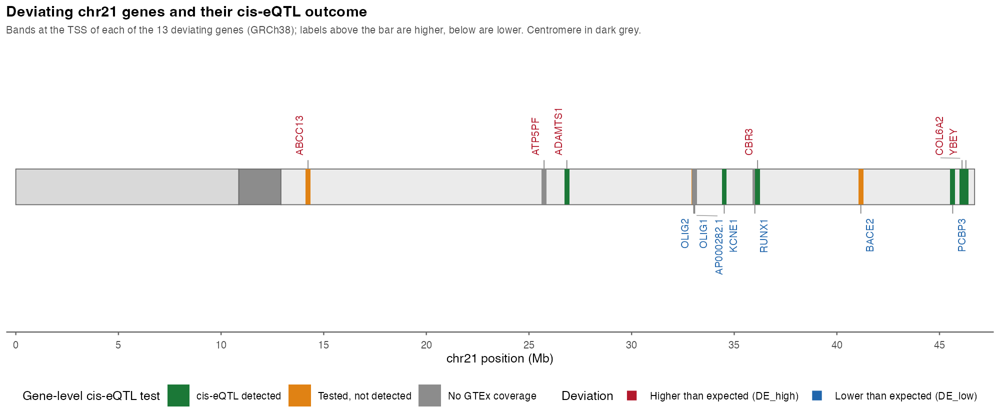

## Discussion  {.page_break_before}

comment: I'd ask a bit of context just a sentence to introduce the gap that we are solving and how

Trisomy 21 increases the expression of most HSA21 genes by the expected 1.5-fold, yet a subset of genes consistently deviates from this dosage expectation [@doi:10.1186/s12915-023-01700-4; @doi:10.1038/s41467-024-49781-1]. Whether these deviations reflect genetic variation, compensatory regulation, or technical artifacts has remained unclear, and the only direct test of the cis-eQTL hypothesis was limited to a single family [@doi:10.1186/s12915-023-01700-4].

comment: I think the gap and main finding is related to test conpensation and eqtl explanation in a large cohort compared to hunter et at

This study supports the conclusion that allele dosage determines most transcriptomic anomalies in people with T21. We demonstrated that the majority of HSA21 genes show the expected 1.5-fold change in gene expression if we filter high repeating genes, genes with low coverage, and adjust the differential expression pipeline for sample ploidy. 
Within the 13 genes that still significantly deviated, 7 showed similar patterns in allele frequency to the typical population in common eQTLs ({@fig:chr21-map}). 
However, 6 genes remain candidates for non cis-eQTL mechanisms underlying their deviance from the expected expression.

comment: not sure if this figure is better in results
{#fig:chr21-map width="90%"}

We can not rule out *ATP5PF*, *RUNX1*, or *AP000282.1* because there were not common eQTLs to test.
The cohort is underpowered to detect new eQTLs. 
However, a lack of evidence is weaker than those where the genotypes did not align in the cohort (*ABCC13*, *BACE2*,*OLIG2*). A literature search provides potential explanations of regulatory effects to account for the deviation of these 3 genes. For example, well documented chronic interferon (IFN) signaling in DS may repress *BACE2* transcription through STAT-driven silencers and IFN-induced microRNAs[@].

**ADD MORE EXPLANATION HERE**

There multiple other additional factors which may explain gene expression deviance.
Candidate non-genetic mechanisms for the lower-than-expected transcript counts include autoregulatory feedback loops, post-transcriptional silencing by triplicated HSA21 miRNAs, cell-composition shifts, chromatin remodeling, alternative splicing into unstable isoforms, or other genomic effects (e.g., pQTLs, trans-eQTLs). 
Future analyses will evaluate alternative hypotheses and merge results with GWAS disease hits to assess relationships to co-occurring conditions.

**In conclusion...**

comment: not sure if it's better, context -> gap -> findings and conclusion and then mention the limitations and future perspectives