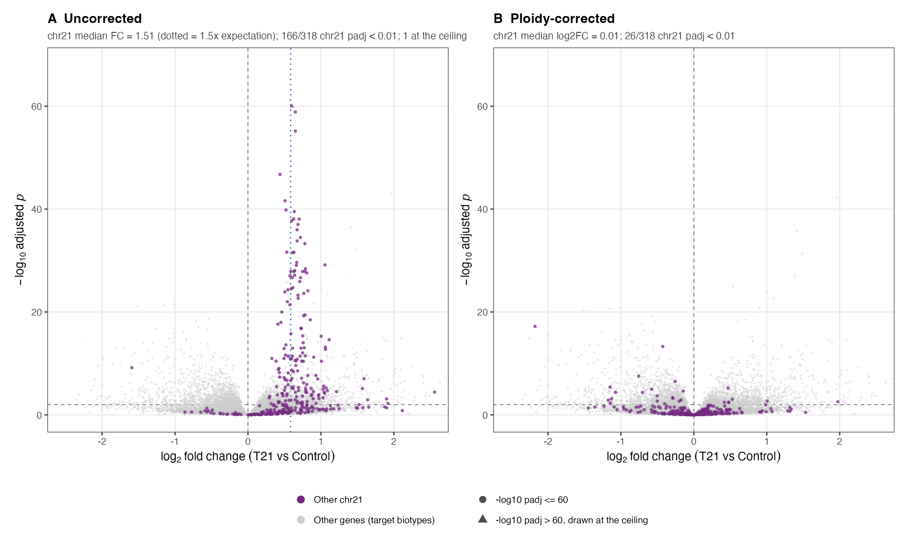
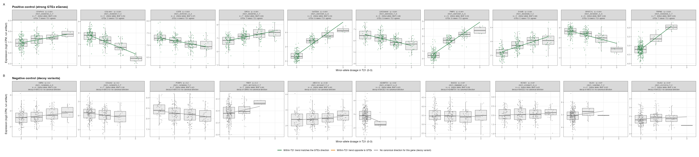

## Supplement {.page_break_before}

### Supplement A: Evidence for covariate adjustment
Before attributing a gene's deviation from the 1.5-fold expectation to HSA21 dosage rather than age, weight, or blood-cell composition, we confirmed, in the full that: (1) several clinical and demographic factors differ significantly by karyotype (age p = 0.033, BMI p < 0.0001; sex a did not differ as strongly); (2) directly measured blood-cell-type composition is associated with expression of thousands of genes genome-wide; and (3) the 9 mosaic-DS subjects, whose cells do not all carry the extra chromosome, show a smaller chromosome-21 dosage effect (mean composite HSA21 index ≈ 1.07x) than subjects with full trisomy (≈1.35-1.45x), a sanity check that the dosage measurement itself behaves as expected. These findings motivate adjusting for age, sex, BMI, sample source, and cell-type composition in the primary analysis ({@fig:s1-covariates}).

{#fig:s1-covariates width="100%"}

## Supplement B: Whole genome differential expression
{#fig:s2-volcano-all width="100%"}

## Supplement C: eQTL dosage controls
{#fig:s3-eqtl-dosage-controls width="100%"}

### Supplement D: Comparison to the unadjusted analysis
Running the identical pipeline without covariate adjustment and without excluding mosaic subjects (397 subjects: 302 DS, 95 control) identified 23 deviating genes (10 higher, 13 lower) rather than 13, and detected a cis-eQTL for 14 of 20 testable genes rather than 7 of 10. Of the 13 genes that deviate in the primary (adjusted) analysis, 6 also deviate in the unadjusted analysis (OLIG2, PCBP3, BACE2, YBEY, COL6A2, ABCC13); the other 7 deviate only once age, weight, and cell-type composition are accounted for (KCNE1, OLIG1, RUNX1, AP000282.1, CBR3, ADAMTS1, ATP5PF). Of the 23 genes that deviate in the unadjusted analysis, 17 drop out once adjusted — though for 11 of those, the effect size is similar in the adjusted model and the gene simply falls short of the stricter significance threshold in the smaller, more heavily parameterized model, rather than the underlying effect disappearing. This comparison is the basis for reporting the adjusted analysis as primary while retaining the unadjusted analysis for transparency ({@fig:s4-comparison}).

{#fig:s4-comparison width="90%"}

