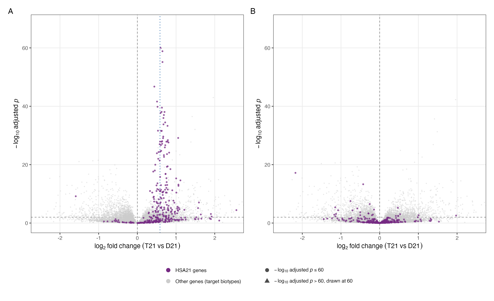
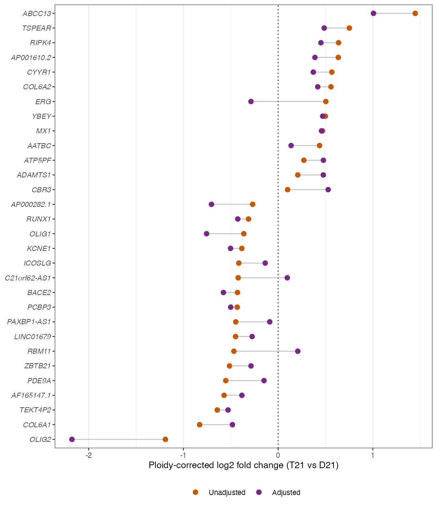

## Supplement {.page_break_before}

### Supplement A: Evidence for covariate adjustment
Before attributing a gene's deviation from the 1.5-fold expectation to HSA21 dosage rather than age, BMI, or blood-cell composition, we confirmed, in the full cohort, that: (1) several clinical and demographic factors differ significantly by karyotype (age p = 0.033, BMI p < 0.0001; sex did not differ as strongly); (2) directly measured blood-cell-type composition is associated with expression of thousands of genes genome-wide; and (3) the 9 mosaic-DS participants, whose cells do not all carry the extra chromosome, show a smaller chromosome-21 dosage effect (mean composite HSA21 index ≈ 1.07x) than participants with full trisomy (≈1.35--1.45x), a sanity check that the dosage measurement itself behaves as expected.
These findings motivate adjusting for age, sex, BMI, sample source, and cell-type composition in the primary analysis (Figure {@fig:s1-covariates}).

{#fig:s1-covariates tag="S1" width="100%"}

<!-- Milton's comment: I think the heading level was wrong? -->

### Supplement B: Whole genome differential expression
{#fig:s2-volcano-all tag="S2" width="100%"}

### Supplement C: Comparison to the unadjusted analysis
Running the identical pipeline without covariate adjustment and without excluding mosaic participants (397 participants: 302 T21, 95 D21) identified 23 deviating genes (10 higher, 13 lower) rather than 13, and detected a *cis*-eQTL for 14 of 20 testable genes rather than 8 of 10.
Of the 13 genes that deviate in the primary (adjusted) analysis, 6 also deviate in the unadjusted analysis (*OLIG2*, *PCBP3*, *BACE2*, *YBEY*, *COL6A2*, *ABCC13*); the other 7 deviate only once age, BMI, and cell-type composition are accounted for (*KCNE1*, *OLIG1*, *RUNX1*, *AP000282.1*, *CBR3*, *ADAMTS1*, *ATP5PF*).
Of the 23 genes that deviate in the unadjusted analysis, 17 drop out once adjusted — though for 11 of those, the effect size is similar in the adjusted model and the gene simply falls short of the stricter significance threshold in the smaller, more heavily parameterized model, rather than the underlying effect disappearing. This comparison is the basis for reporting the adjusted analysis as primary while retaining the unadjusted analysis for transparency (Figure {@fig:s3-comparison}).

{#fig:s3-comparison tag="S3" width="90%"}

### Supplement D: HSA21 differential expression (Supplementary Table S1)
`data/supplementary_table_S1_hsa21_differential_expression.csv` holds one row for each of the 318 targeted HSA21 genes: the DESeq2 base mean, the uncorrected and ploidy-corrected log2 fold change and adjusted p-value, the coverage and repeat flags, the dosage classification, and, for the genes that deviate, the gene-level *cis*-eQTL permutation result together with the best variant, its minor allele, and that allele's frequency.
It is the source for Tables {@tbl:chr21-classification} and {@tbl:eqtl-genes}, and Figure {@fig:flow-map}.

### Supplement E: Common allele overlap (Supplementary Table S2)
`data/supplementary_table_S2_common_allele_overlap.csv` holds one row for each of the 2,076 *cis* variants tested within T21: position, reference and alternate allele, the alternate allele frequency in GTEx whole blood, in gnomAD v4.1 (global and non-Finnish European), and in this cohort, the minor allele each of those frequencies implies, and whether the three sources agree.
It supports the minor-allele labels used in the figures, and shows where a variant's two alleles are too close in frequency for those labels to be stable.

### Supplement F: Genotype structure in the within-T21 eQTL tests
The *cis*-eQTL model does not include genotype principal components, so we measured genotype structure in the within-T21 tests directly.
For each of the 153 assessable HSA21 genes (not repeat-flagged, base mean ≥ 30), T21 expression was regressed on every common variant on the HSA21 long arm (minor allele frequency ≥ 0.05 and call rate ≥ 0.95 among the T21 participants analyzed; 97,438 variants) at least 5 Mb from the gene's transcription start site, one ordinary least-squares regression per gene–variant pair (11.1 million pairs).
At that distance a variant cannot tag the gene's own *cis* locus, so in the absence of structure the p-values are uniform and the genomic inflation factor λ is 1.
Variants on the short arm and around the centromere were set aside: GRCh38 places false duplications of 21q22.3 there [@doi:10.1126/science.abl3533; @doi:10.1186/s13059-023-02863-7], so a variant's coordinate can put a long-arm gene's own *cis* signal more than 5 Mb away (for *GATD3A*, *PWP2*, *SIK1*, and *ICOSLG*, down to p ≈ 10^−46^); including them changes λ by less than 0.02.
Two references were used to read λ.
The same regressions were run for 400 expressed HSA22 genes: population structure would inflate their tests as much as those of HSA21 genes, whereas a signal tied to HSA21 copy number would not.
Participant labels were also permuted 200 times, jointly across genes, which keeps the correlation between genes and the linkage disequilibrium between variants; the spread of λ over these permutations is its sampling range for these correlated tests, about ±0.04 for a gene set.

Without covariate adjustment (302 T21 participants), λ was 1.074 for HSA21 genes and 1.044 for HSA22 genes, both above their permutation ranges, and 26 HSA21 genes lay outside their own permutation range, against a permutation median of 3 (Figure {@fig:s4-distal-inflation}A, B).
In the primary analysis (274 T21 participants), with age, sex, BMI, sample source, and cell-type composition regressed out of both expression and genotype dosage as in the *cis*-eQTL test, λ was 1.020 for HSA21 genes (permutation range 0.966–1.031), 1.016 for the 13 deviating genes, and 1.017 for HSA22 genes, all within their permutation ranges.
Three of the 24 adjustment covariates were themselves associated with HSA21 genotype across the chromosome, against a permutation median of 0 (Figure {@fig:s4-distal-inflation}D): recruitment at NDSC2019 and the CD27+ B-cell and CD4+ central memory T-cell fractions.
The adjusted tests are therefore not inflated beyond their permutation range at the level of the gene set, but the adjustment reaches that through covariates that track genotype structure rather than through a direct measure of ancestry, and some gene-level structure may remain: 11 HSA21 genes lay outside their own permutation range against a permutation median of 3 (p = 0.04), among them two deviating genes, *COL6A2* and *ABCC13* (permutation p = 0.020 and 0.025; Figure {@fig:s4-distal-inflation}C).

![Genotype structure in the within-T21 tests. (A) Quantile–quantile plots of T21 expression regressed on common HSA21 long-arm variants at least 5 Mb from each gene, for the assessable HSA21 genes (top) and for HSA22 reference genes (bottom), without covariate adjustment (unadjusted) and with the covariates regressed out of expression and genotype (adjusted); shaded, 95% range over 200 participant permutations. Each plot shows expected −log~10~ p up to 4, where most tests lie; the inset shows the full range with that window outlined. (B) Genomic inflation factor λ per gene set with its permutation 95% range. (C) Per-gene λ in the adjusted analysis, HSA21 assessable and HSA22 reference genes, deviating genes in green; filled points lie outside the gene's own permutation 95% range. (D) Each covariate of the adjusted analysis regressed on every common HSA21 long-arm variant; filled points lie outside their own permutation 95% range.](images/figures/fig_distal_inflation.png){#fig:s4-distal-inflation tag="S4" width="100%"}

### Supplement G: Expression of the HSA21 genes in blood
We compared HSA21 gene expression in GTEx v10 whole blood and other tissues.
The deviating genes' whole-blood expression was lower than that of the expected-dosage genes, but not significantly (median 1.3 vs 3.1 TPM, Wilcoxon p = 0.34; Figure {@fig:s5-gtex-expression}A).

Expression did not predict eQTL detection (Figure {@fig:s5-gtex-expression}B).
Among the 211 HSA21 genes GTEx tested in whole blood, eGenes and non-eGenes had similar expression (median 1.28 vs 1.18 TPM, p = 0.36).
Genes with a *cis*-eQTL detected in T21 were, if anything, less expressed than those without (median 2.4 vs 3.9 TPM, p = 0.13).

Whole blood ranks low among the GTEx tissues for most genes (median rank 64 of 68 for the expected-dosage genes; Figure {@fig:s5-gtex-expression}C). 
Expression in the T21 participants tracked GTEx closely (Spearman 0.87 across the 309 HSA21 genes; Figure {@fig:s5-gtex-expression}D).
The HTP values were 2.8-fold higher overall.
Part of this offset may come from globin depletion: the three main hemoglobin genes take 0.4% of HTP TPM, against 30% in GTEx whole blood.

*AP000282.1* has zero expression in GTEx whole blood but a median of 4.6 TPM in the T21 participants.
Its first exon lies inside the single exon of *OLIG1*, on the opposite strand.
GTEx libraries are unstranded, so GTEx removes exon regions shared between genes before counting [@doi:10.1126/science.aaz1776].
The HTP libraries are stranded and were counted by strand, so the T21 counts belong to *AP000282.1* itself.
*AP000282.1* is correlated with *OLIG1* (Spearman 0.67 in T21 after covariate adjustment).
*OLIG1*, *OLIG2*, and *AP000282.1* may deviate as one locus rather than independently.

![Expression of the HSA21 genes in blood. (A) GTEx v10 whole-blood median TPM of the classified HSA21 genes by classification. Deviating genes are colored by direction. (B) GTEx whole-blood eGene q-value against whole-blood TPM for the 109 genes tested in T21. Filled points have a *cis*-eQTL detected in T21, grey points are expected-dosage genes, and the dashed line marks q = 0.05. (C) Median TPM of each deviating gene in the 68 GTEx tissues. Whole blood (large point) is on the gene's line, and the other tissues are grouped by organ system below it. Labels give the rank of whole blood among the 68 tissues. (D) Median TPM in the 274 T21 participants against GTEx whole-blood TPM for the 309 classified HSA21 genes in GTEx. The dotted line marks equality, and the dashed line marks the genome-wide HTP/GTEx offset (2.8-fold).](images/figures/gtex_tissue_expression.png){#fig:s5-gtex-expression tag="S5" width="100%"}
