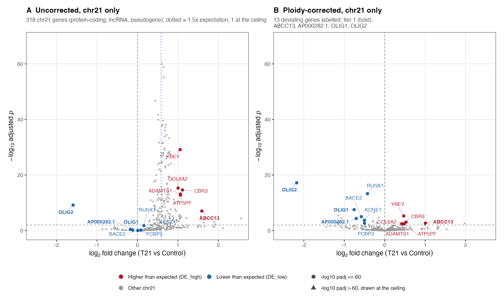
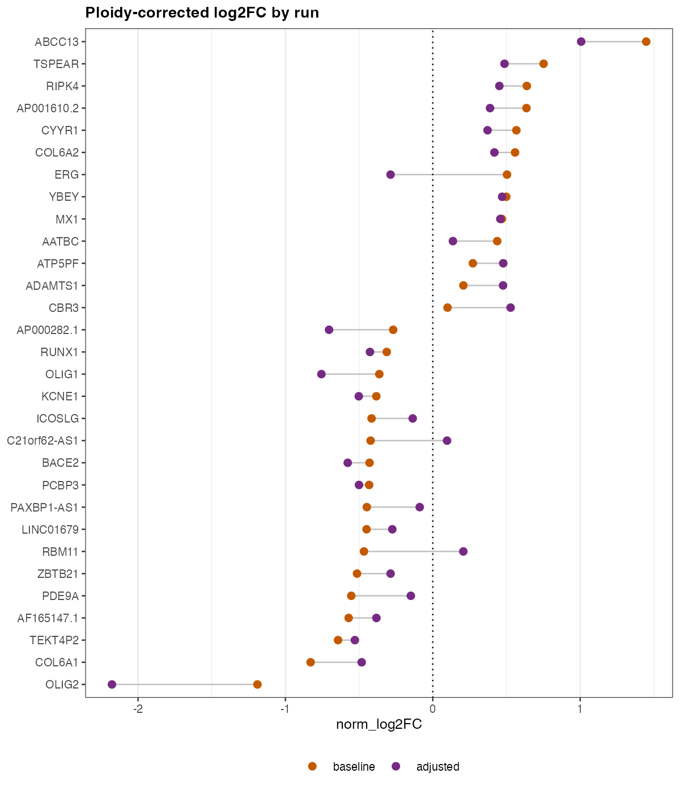

---
title: Cis-gene regulation explains most chromosome 21 expression deviations from the ploidy expectation in Down syndrome
keywords:
- markdown
- publishing
- manubot
lang: en-US
date-meta: '2026-09-25'
author-meta:
- Lucas A. Gillenwater
- Marc Subirana-Granés
- Mary A. Allen
- Milton Pividori
- Casey S. Greene
header-includes: |
  <!--
  Manubot generated metadata rendered from header-includes-template.html.
  Suggest improvements at https://github.com/manubot/manubot/blob/main/manubot/process/header-includes-template.html
  -->
  <meta name="dc.format" content="text/html" />
  <meta property="og:type" content="article" />
  <meta name="dc.title" content="Cis-gene regulation explains most chromosome 21 expression deviations from the ploidy expectation in Down syndrome" />
  <meta name="citation_title" content="Cis-gene regulation explains most chromosome 21 expression deviations from the ploidy expectation in Down syndrome" />
  <meta property="og:title" content="Cis-gene regulation explains most chromosome 21 expression deviations from the ploidy expectation in Down syndrome" />
  <meta property="twitter:title" content="Cis-gene regulation explains most chromosome 21 expression deviations from the ploidy expectation in Down syndrome" />
  <meta name="dc.date" content="2026-09-25" />
  <meta name="citation_publication_date" content="2026-09-25" />
  <meta property="article:published_time" content="2026-09-25" />
  <meta name="dc.modified" content="2026-09-25T19:17:32+00:00" />
  <meta property="article:modified_time" content="2026-09-25T19:17:32+00:00" />
  <meta name="dc.language" content="en-US" />
  <meta name="citation_language" content="en-US" />
  <meta name="dc.relation.ispartof" content="Manubot" />
  <meta name="dc.publisher" content="Manubot" />
  <meta name="citation_journal_title" content="Manubot" />
  <meta name="citation_technical_report_institution" content="Manubot" />
  <meta name="citation_author" content="Lucas A. Gillenwater" />
  <meta name="citation_author_institution" content="Department of Biomedical Informatics, University of Colorado Anschutz, Aurora, CO" />
  <meta name="citation_author_orcid" content="0000-0003-3158-9682" />
  <meta name="citation_author" content="Marc Subirana-Granés" />
  <meta name="citation_author_institution" content="Department of Biomedical Informatics, University of Colorado Anschutz, Aurora, CO" />
  <meta name="citation_author_orcid" content="0000-0003-3934-839X" />
  <meta name="citation_author" content="Mary A. Allen" />
  <meta name="citation_author_institution" content="BioFrontiers Institute, University of Colorado Boulder, Boulder, CO" />
  <meta name="citation_author_orcid" content="0000-0001-7490-0165" />
  <meta name="citation_author" content="Milton Pividori" />
  <meta name="citation_author_institution" content="Department of Biomedical Informatics, University of Colorado Anschutz, Aurora, CO" />
  <meta name="citation_author_orcid" content="0000-0002-3035-4403" />
  <meta name="citation_author" content="Casey S. Greene" />
  <meta name="citation_author_institution" content="Department of Biomedical Informatics, University of Colorado Anschutz, Aurora, CO" />
  <meta name="citation_author_orcid" content="0000-0001-8713-9213" />
  <link rel="canonical" href="https://greenelab.github.io/T21-cis-eqtl-Chr21-regulation-manuscript/" />
  <meta property="og:url" content="https://greenelab.github.io/T21-cis-eqtl-Chr21-regulation-manuscript/" />
  <meta property="twitter:url" content="https://greenelab.github.io/T21-cis-eqtl-Chr21-regulation-manuscript/" />
  <meta name="citation_fulltext_html_url" content="https://greenelab.github.io/T21-cis-eqtl-Chr21-regulation-manuscript/" />
  <meta name="citation_pdf_url" content="https://greenelab.github.io/T21-cis-eqtl-Chr21-regulation-manuscript/manuscript.pdf" />
  <link rel="alternate" type="application/pdf" href="https://greenelab.github.io/T21-cis-eqtl-Chr21-regulation-manuscript/manuscript.pdf" />
  <link rel="alternate" type="text/html" href="https://greenelab.github.io/T21-cis-eqtl-Chr21-regulation-manuscript/v/3d229750d469c349e702f9780a2bf15e73c92061/" />
  <meta name="manubot_html_url_versioned" content="https://greenelab.github.io/T21-cis-eqtl-Chr21-regulation-manuscript/v/3d229750d469c349e702f9780a2bf15e73c92061/" />
  <meta name="manubot_pdf_url_versioned" content="https://greenelab.github.io/T21-cis-eqtl-Chr21-regulation-manuscript/v/3d229750d469c349e702f9780a2bf15e73c92061/manuscript.pdf" />
  <meta property="og:type" content="article" />
  <meta property="twitter:card" content="summary_large_image" />
  <link rel="icon" type="image/png" sizes="192x192" href="https://manubot.org/favicon-192x192.png" />
  <link rel="mask-icon" href="https://manubot.org/safari-pinned-tab.svg" color="#ad1457" />
  <meta name="theme-color" content="#ad1457" />
  <!-- end Manubot generated metadata -->
bibliography:
- content/manual-references.json
manubot-output-bibliography: output/references.json
manubot-output-citekeys: output/citations.tsv
manubot-requests-cache-path: ci/cache/requests-cache
manubot-clear-requests-cache: false
...

<small><em>
This manuscript
([permalink](https://greenelab.github.io/T21-cis-eqtl-Chr21-regulation-manuscript/v/3d229750d469c349e702f9780a2bf15e73c92061/))
was automatically generated
from [greenelab/T21-cis-eqtl-Chr21-regulation-manuscript@3d22975](https://github.com/greenelab/T21-cis-eqtl-Chr21-regulation-manuscript/tree/3d229750d469c349e702f9780a2bf15e73c92061)
on September 25, 2026.
</em></small>

## Authors

+ **Lucas A. Gillenwater**
   
    {.inline_icon width=16 height=16}
    [0000-0003-3158-9682](https://orcid.org/0000-0003-3158-9682)
     
  <small>
     Department of Biomedical Informatics, University of Colorado Anschutz, Aurora, CO
  </small>

+ **Marc Subirana-Granés**
   
    {.inline_icon width=16 height=16}
    [0000-0003-3934-839X](https://orcid.org/0000-0003-3934-839X)
     
  <small>
     Department of Biomedical Informatics, University of Colorado Anschutz, Aurora, CO
  </small>

+ **Mary A. Allen**
   
    {.inline_icon width=16 height=16}
    [0000-0001-7490-0165](https://orcid.org/0000-0001-7490-0165)
     
  <small>
     BioFrontiers Institute, University of Colorado Boulder, Boulder, CO
  </small>

+ **Milton Pividori**
   
    {.inline_icon width=16 height=16}
    [0000-0002-3035-4403](https://orcid.org/0000-0002-3035-4403)
     
  <small>
     Department of Biomedical Informatics, University of Colorado Anschutz, Aurora, CO
  </small>

+ **Casey S. Greene**
   
    {.inline_icon width=16 height=16}
    [0000-0001-8713-9213](https://orcid.org/0000-0001-8713-9213)
     
  <small>
     Department of Biomedical Informatics, University of Colorado Anschutz, Aurora, CO
  </small>

::: {#correspondence}
✉ — Correspondence possible via [GitHub Issues](https://github.com/greenelab/T21-cis-eqtl-Chr21-regulation-manuscript/issues)

:::

## Abstract {.page_break_before}

Down syndrome (DS) results from trisomy of human chromosome 21 (HSA21).
On average, genes on HSA21 are overexpressed at the expected 1.5-fold increase.
A small subset of HSA21 genes is expressed closer to euploid controls.
Could local genetic regulatory variation explain deviations from the expected dosage?
Using the largest DS-specific transcriptomic dataset to date from the Human Trisome Project (HTP) and GTEx expression quantitative trait loci (eQTLs), we tested whether local genetic regulatory variation contributes to gene-specific buffering or amplification of HSA21 dosage effects in DS.

We compared the bulk RNAseq profiles of protein-coding genes from whole blood samples of 274 people with DS and 80 people diploid for HSA21.
We filtered out genes with low read counts or high genomic repeat content and applied ploidy correction to the differential expression analysis.
We found 13 genes that differed significantly from the expected fold change.
We cross-referenced GTEx whole blood eQTLs (*cis* window ±1 Mb) with the 13 differentially expressed genes.
Seven genes had a detected common *cis*-eQTL.
The higher-than-expected expression of *ABCC13* and the lower-than-expected expression of *BACE2* and *OLIG2* did not have a genomic explanation despite a testable *cis*-eQTL.

Overall, allele dosage determines most transcriptomic anomalies in people with T21.
A few gene deviations not explained require other mechanistic explanations.

## Introduction {.page_break_before}

The triplication of human chromosome 21 (HSA21), trisomy 21 (T21), causes Down syndrome (DS).
Multiple studies report that genes on HSA21 are expressed, on average, at the expected 1.5-fold change when compared to people with euploid karyotypes (disomic 21, D21) [@doi:10.1038/s41588-023-01399-7; @doi:10.1126/sciadv.adg6218; @doi:10.1016/j.celrep.2022.111883; @doi:10.1038/s41467-024-49781-1].
A small subset of HSA21 genes is expressed closer to euploid levels.
Potential causes for lower-than-expected HSA21 gene expression include confounding cell type proportions, genetic effects, and compensatory regulation.
This study assesses the genetic effect hypothesis while controlling for cell type proportions.

Previous researchers have noted that differences in genetic composition affect clinical and molecular phenotypes in DS.
Rachubinski et al. hypothesized that genetic variations beyond T21 may explain the development of autism spectrum disorder in some individuals with DS [@doi:10.1002/PD.4957].
Valentini et al. assessed genomic effects with a genome-wide association study (GWAS) in a cohort of 84 children with DS and found that *PNPLA3* rs738409 variants on HSA22 were associated with liver steatosis [@doi:10.1016/j.numecd.2020.05.012].
A review by Antonarakis et al. noted that ~80% of T21 conceptuses are lost during pregnancy and inferred that a specific combination of genetic variants allows T21 conceptuses to survive to term [@doi:10.1038/s41572-019-0143-7].
In 388 live-born individuals with DS, Popadin et al. found signatures of embryonic selection: a deficit of deleterious variants on HSA21 and reduced transcriptome-wide variation in the expression of highly constrained genes [@doi:10.1101/gr.228411.117].

Hunter et al. tested whether the genotype of common expression quantitative trait loci (eQTLs) explained lower-than-expected gene expression of HSA21 genes in a child with DS compared to family members (i.e., brother, mother, and father euploid for HSA21) [@doi:10.1186/s12915-023-01700-4].
The authors introduced a methodology to control for common factors that bias differential expression studies in DS research.
Specifically, the methodology accounted for genes with no reads, low gene expression, high genomic repeats, and karyotype.
Overall, the analysis confirmed that the majority of HSA21 genes show the expected 1.5-fold change.
There were 5 genes that fell below the expected fold change.
Of those 5 genes, 3 had common eQTLs in the general population.
Genotyping confirmed that the allele dosage at those eQTLs explained the lower-than-expected gene expression in the individual with DS.

Here we extend the methodology of Hunter et al. to the population level.
We assess how *cis*-eQTLs on HSA21 affect whole blood gene expression in a large cohort of individuals with and without DS.
We account for triploidy and cell type composition in the differential expression analysis.
We perform ploidy-aware genotyping of HSA21 in people with T21 to accurately represent allele counts.
We compare the sample genotypes against common eQTLs found in whole blood of disomic individuals in the GTEx cohort.
Overall, the results confirm the findings of Hunter et al. (allele frequencies in common eQTLs explain the majority of lower-than-expected gene expression in people with DS) in a higher-powered study.

## Methods {.page_break_before}

<!-- Milton's comments:
- would it be better to have the Results section first, and move this one after the Discussion?
-->

### Study Consent
As part of the INCLUDE project, the Linda Crnic Institute for Down Syndrome at the University of Colorado Anschutz Medical Campus enrolled participants under a study protocol approved by the Colorado Multiple Institutional Review Board (COMIRB #15-2170).
Human Trisome Project (HTP) researchers at the Linda Crnic Institute for Down Syndrome obtained written informed consent from all participants over 7 years old as allowed by their cognitive ability or their legally authorized representative.
Regardless of study participant age or cognitive ability, researchers explained study procedures to the participant.
HTP researchers recorded age, sex, and body mass index (BMI) during the visit.

### Whole-blood transcriptome quantification
Waugh et al. [@doi:10.1038/s41588-023-01399-7] describe the process of blood collection, processing, and quantification in detail.
Briefly, researchers collected peripheral blood in PAXgene RNA tubes (QIAGEN), performed poly-A+ RNA enrichment, and used the Illumina NovaSeq 6000 (Novogene) to do paired-end sequencing before additional bioinformatic processing to produce gene-level count data.

### Mass cytometry of white blood cells
For a detailed account of the quantification of white blood cells, see Galbraith et al. [@doi:10.1126/sciadv.adg6218].
Whole blood samples underwent red blood cell lysis and white blood cell fixation, followed by barcoding with a Cell-ID 20-Plex Pd kit and pooling.
Pooled samples were stained with antibodies, with surface marker staining performed before permeabilization and intracellular transcription factor/phospho-epitope staining performed after.
Cells were then labeled with Cell-ID Intercalator-Ir and quantified on a Helios mass cytometer.
Batched FCS files were demultiplexed and individual samples were normalized across batches.

### Mosaic Karyotyping
<!-- Milton's comment: make this question explicit in the email; not sure if Mary will see it here -->
[@Mary], how did you create the table of mosaic karyotypes?

### Whole genome sequencing
Whole genome sequencing of Human Trisome Project participants was performed at the Broad Institute as part of the NIH INCLUDE and Gabriella Miller Kids First projects, and the cohort is described by Feldman et al. [@doi:10.1002/gepi.70010].
PCR-free libraries were prepared from genomic DNA sheared to approximately 385 bp using the KAPA Hyper Prep kit without amplification, and sequenced to a target read depth of ~30x coverage to produce 151 bp paired-end reads.

<!-- Milton's comment: check this comment below: -->

**comment: the CRAM read groups of the HTP samples report NovaSeq 6000 S4 flowcells (all flowcell IDs end in DSXX, sequenced December 2019 to January 2020), whereas Feldman et al. state Illumina HiSeqX. Confirm the instrument across all 433 CRAM headers on Alpine before naming it here.**

Reads were aligned to the GRCh38 reference genome (Homo_sapiens_assembly38) with BWA-MEM v0.7.15, duplicate-marked with Picard v2.20.4, and base quality score recalibrated with GATK v4.0.10.1 using the Broad WholeGenomeGermlineSingleSample workflow.
These analysis-ready CRAM files were used as the input for variant calling, without further preprocessing.

### Ploidy-aware variant calling on HSA21
Standard germline genotyping workflows assume a diploid genome and therefore misassign allele dosage on HSA21 in individuals with T21; for this reason, chromosome 21 was excluded from the association analyses of Feldman et al. [@doi:10.1002/gepi.70010].
We therefore re-called HSA21 variants directly from the aligned CRAM files with a ploidy-aware caller.
Variants on HSA21 were called in 433 Human Trisome Project participants with whole genome sequencing data, comprising 419 individuals with T21 and 14 euploid controls.
Variants were called against the same GRCh38 reference with Octopus v0.7.4 [@doi:10.1038/s41587-021-00861-3], using the individual caller on each sample independently and restricting calling to HSA21 (--regions chr21).
The ploidy of HSA21 was set to 3 for individuals with T21 (--contig-ploidies chr21=3), whereas control samples were called at the default ploidy of 2.
All other Octopus parameters were left at their default values.

Calls were filtered with the default Octopus hard-filter expression (QUAL < 10, MQ < 10, MP < 10, AD < 1, AF < 0.01, AFB > 0.25, SB > 0.98, BQ < 15, DP < 1, ADP < 1), and only records with FILTER = PASS were retained using BCFtools v1.21 [@doi:10.1093/gigascience/giab008].
Filtering retained approximately 85% of raw calls, corresponding to a median of 81,667 variants per T21 sample (range, 59,473 to 104,854) and 66,238 variants per control sample (range, 63,054 to 80,735).

PASS-filtered per-sample calls were merged separately for the T21 and control groups with bcftools merge, keeping distinct alternate alleles at the same position as separate records (--merge none).
Samples with no call at a merged site were assigned the reference genotype at their respective ploidy (--missing-to-ref; 0/0/0 for T21 and 0/0 for controls).
The resulting call sets comprised 688,787 variant records in the T21 group (529,386 SNVs and 160,468 indels) and 189,474 variant records in the control group (142,792 SNVs and 46,845 indels).
The workflow was implemented in Snakemake v9.16.3 [@doi:10.12688/f1000research.29032.2] and run on the Alpine high-performance computing cluster (University of Colorado Boulder Research Computing).

<!-- Milton's comment: see if title heading correction below is fine -->
### Cohort filtering
To assess genetic effects, we required samples to have matched whole blood bulk RNA sequencing counts, whole genome sequencing, cell type composition, as well as all demographic and technical data (i.e., age, sex, BMI, and sample source) ({@fig:s1-covariates}A).
Additionally, while 95% of individuals with DS have full T21, 5% are mosaic for T21.
Mosaicism affects expression levels ({@fig:s1-covariates}C) and genotyping penetrance across cells.
Therefore, we removed samples with mosaic karyotypes (i.e., mosaic or translocation).

### Ploidy-aware differential expression analysis
Generally, we followed the methods of Hunter et al. [@doi:10.1186/s12915-023-01700-4].
We compared DESeq2 [@doi:10.1186/s13059-014-0550-8] fits using default parameters against fits that set the expected fold change to 1.5 for HSA21 genes in DS samples and to 1 for all other gene-karyotype combinations.
We excluded HSA21 from the size-factor (library normalization) calculation so that HSA21's own inflated counts do not bias normalization for the rest of the genome.
As a negative control, we assessed the change in distribution for HSA22 genes between the run with default parameters and the ploidy-adjusted run.

The model included age, sex, BMI, and sample source as covariates.
In addition, cell type proportions affect gene expression ({@fig:s1-covariates}B).
Therefore, we included 19 cell-type proportions as covariates in the model.
<!-- Milton's comment: added BH paper below instead of jstor url -->
P-values were adjusted for multiple testing across genes using the Benjamini-Hochberg procedure [@doi:10.1111/j.2517-6161.1995.tb02031.x].

We restricted HSA21 gene biotypes in whole blood to protein-coding, lncRNA, and pseudogenes since those are the gene biotypes covered by the GTEx eQTL data.
We excluded genes with low average read counts (baseMean < 30) or that fall in genomic regions with high repeat content that cannot be reliably quantified.
A gene was classified as deviating from the 1.5-fold ploidy expectation if its ploidy-corrected fold change differed from 1.5 by at least 33% (adjusted p < 0.01).
Deviating genes were further stratified into tier 1 (≥50% deviation from the 1.5-fold expectation) and tier 2 (33–50% deviation).

### *cis*-eQTL association testing
For each deviating gene, we retrieved all variants within ±1 Mb that GTEx annotates as at least nominally associated with that gene's expression in whole blood.
We regressed the covariate-adjusted expression measure against genotype dosage (0-3 copies of the alternate allele) within T21 subjects, and retained each gene's strongest-associated variant.
We report every effect direction per copy of the minor allele, taking the minor allele from the GTEx whole-blood frequency and checking it against gnomAD v4.1.
We report the genotype code, whether the major or minor allele, that has the significant effect in the population.
<!-- Milton's comment: are you running more permutations for genes that are borderline significant? -->
Statistical significance was assessed by a gene-level permutation test where expression values were shuffled across subjects 1,000 times, the same variant search was repeated on each shuffle, and the fraction of shuffles producing an association at least as strong as the observed one gave a gene-level permutation p-value.
Permutation p-values were adjusted for multiple testing across genes using the Benjamini-Hochberg procedure [@doi:10.1111/j.2517-6161.1995.tb02031.x].

We evaluated this procedure with two controls run through the identical pipeline.
As a negative control, each deviating gene was tested against variants near an unrelated gene ≥5 Mb away.
As a positive control, we tested the 10 HSA21 genes with the strongest GTEx whole-blood eQTL signal.

### Sensitivity analysis
To quantify the effect of covariate adjustment and mosaic exclusion, we compared the adjusted results to the outputs from the identical pipeline without covariate adjustment and without excluding mosaic subjects ({@fig:s1-covariates}D, {@fig:s4-comparison}).

## Results {.page_break_before}

### Most chromosome 21 genes show gene-dosage-dependent increase in expression
To determine whether HSA21 genes in whole blood from people with T21 are expressed in proportion to their extra copy, we compared transcript levels between T21 and D21 individuals before and after ploidy correction.

The HTP RNAseq cohort consisted of 399 individuals, 304 with DS and 95 euploid controls.
Filtering removed samples missing cell-type composition (22) or BMI metadata (12), and samples with mosaic karyotypes for HSA21 (9).
We also filtered samples from people with DS that did not have WGS data (2).
We compared whole blood bulk RNA transcript counts between 274 T21 samples and 80 D21 samples, a total of 354 samples.
People with DS had significantly higher body mass index (BMI) than those with euploid karyotypes ({@tbl:cohort-characteristics}).
Additionally, the D21 individuals were significantly older than those with T21 karyotypes.
The sex composition did not significantly differ by karyotype.
Though processed at the same facility, the samples were collected at 3 different locations.

| Characteristic | Level | T21 (n=274) | Control (n=80) |  P-value |
|---|---|---|---|---|
| Age at visit (years) | median [IQR] | 24.0 [16.1-32.5] | 27.4 [16.3-37.8] |  0.0802 |
| BMI | median [IQR] | 27.6 [23.1-33.4] | 24.2 [20.4-27.4] |  < 0.0001 |
| Sex | Female | 124 (45.3%) | 45 (56.2%) | 0.0982 |
| | Male | 150 (54.7%) | 35 (43.8%) | |
| Sample source | Local | 81 (29.6%) | 54 (67.5%) | 0.0005 |
| | NDSC2018 | 81 (29.6%) | 7 (8.8%) | |
| | NDSC2019 | 112 (40.9%) | 19 (23.8%) | |

Table: Analysis cohort assembly and baseline characteristics, stratified by karyotype. {#tbl:cohort-characteristics}

We assessed the effects of ploidy correction on the differential expression analysis.
Of the 318 HSA21 genes, 153 had baseMean coverage $\ge$ 30 and were not in high-repeat regions.
Before ploidy correction, statistically significant (adjusted p < 0.01) fold changes $\ge$ 1.33 were observed in 76% (117) of the HSA21 genes passing thresholds.
After ploidy correction, 8.5% (13) of HSA21 genes had significant fold changes (either up or down) (Table {@tbl:chr21-classification}, and Figures {@fig:flow-map}A, {@fig:volcano-chr21}, {@fig:s2-volcano-all}).
Per-gene statistics for all 318 genes are given in Supplementary Table S1.
The magnitude of the correction matches the ploidy expectation.
Across the 318 HSA21 genes, the median fold change shifted from 0.601 (~log2(1.5) = 0.585) before correction to 0.016 after correction.
Chromosome 22 showed no shift, confirming that the correction is specific to HSA21 (Figure {@fig:ploidy-correction}).

{#fig:volcano-chr21 width="90%"}

{#fig:ploidy-correction width="90%"}

| Category | Genes |
|---|---|
| Expected dosage | 129 |
| Low expression (not assessable) | 153 |
| High repeats (not assessable) | 12 |
| Near-threshold, not significant | 11 |
| Deviates, higher (DE_high) | 6 |
| Deviates, lower (DE_low) | 7 |

Table: Classification of all 318 targeted HSA21 genes in the primary (adjusted) analysis. {#tbl:chr21-classification}

### *cis*-eQTLs explain variance in most deviating genes
To assess potential genetic effects explaining deviating genes, we compared the ploidy-aware genotypes and covariate-adjusted whole blood gene expression of 274 people with DS to common whole blood eQTLs.
Of the 13 deviating genes, 3 (*ATP5PF*, *RUNX1*, *AP000282.1*) have no GTEx-tested variant nearby.
Of the remaining 10 testable genes, 7 have a detected *cis*-eQTL and 3 do not (*ABCC13*, *BACE2*, *OLIG2*) (Table {@tbl:eqtl-genes}, Figures {@fig:eqtl-dosage} and {@fig:flow-map}A).
All 13 deviating genes sit on the q arm, between 14.2 and 46.3 Mb (Figure {@fig:flow-map}B).
Allele frequencies for every tested variant, in GTEx whole blood, in gnomAD and in this cohort, are given in Supplementary Table S2.

| Gene | Direction | Tier | *cis*-eQTL status |
|---|---|---|---|
| *ABCC13* | Higher | 1 | Tested, not detected |
| *CBR3* | Higher | 2 | Detected |
| *ADAMTS1* | Higher | 2 | Detected |
| *YBEY* | Higher | 2 | Detected |
| *COL6A2* | Higher | 2 | Detected |
| *ATP5PF* | Higher | 2 | Not testable (no GTEx data) |
| *OLIG2* | Lower | 1 | Tested, not detected |
| *OLIG1* | Lower | 1 | Detected |
| *AP000282.1* | Lower | 1 | Not testable (no GTEx data) |
| *BACE2* | Lower | 2 | Tested, not detected |
| *KCNE1* | Lower | 2 | Detected |
| *PCBP3* | Lower | 2 | Detected |
| *RUNX1* | Lower | 2 | Not testable (no GTEx data) |

Table: *cis*-eQTL status of the 13 genes that deviate from the ploidy expectation in the primary (adjusted) analysis. {#tbl:eqtl-genes}

![For each of the 10 testable deviating genes, expression against allele copy number in T21, at the variant with the strongest within-cohort signal. Each panel is drawn against the allele that GTEx links to that gene's own direction of deviation. A panel therefore trends up in A, the genes expressed higher than expected, and down in B, the genes expressed lower, when the cohort reproduces the GTEx direction. Panel labels give the minor allele, its frequency, and whether the minor allele runs with or against the deviation.](images/figures/fig_eqtl_dosage_panels.png){#fig:eqtl-dosage width="100%"}

Effect sizes on the deviating genes' best variants were modest (~0.13--0.20 log2-CPM per additional copy of the minor allele).
The effect sizes were similar in magnitude to negative controls (~0.12), which tested variants near an unrelated gene ≥5 Mb away.
The effect sizes were much smaller than positive controls (~0.48), which included the 10 HSA21 genes with the strongest GTEx whole-blood eQTL signal (Figures {@fig:eqtl-effects} and {@fig:s3-eqtl-dosage-controls}).

{#fig:eqtl-effects width="90%"}

{#fig:flow-map width="100%"}

In summary, after ploidy correction most HSA21 genes showed the expected increase with gene dosage.
Only 13 deviated.
Common *cis*-eQTLs may explain some of the variance in 7 of the deviating genes, though the effect sizes are small.
Six genes remain open candidates for a mechanism other than a common *cis*-eQTL: 3 that were tested and showed no genetic signal (*ABCC13*, *BACE2*, *OLIG2*), and 3 that could not be tested for lack of common GTEx data (*ATP5PF*, *RUNX1*, *AP000282.1*) (Figure {@fig:flow-map}).

## Discussion {.page_break_before}

Trisomy 21 increases the expression of most HSA21 genes by the expected 1.5-fold, yet there is a subset of HSA21 genes with expression more similar to disomic individuals [@doi:10.1186/s12915-023-01700-4; @doi:10.1038/s41467-024-49781-1].
Lower- or higher-than-expected gene expression may reflect genetic variation across the population, compensatory regulation, or technical artifacts.
No one had yet assessed the genetic variation hypothesis with gene expression and WGS profiles from a large, population-level cohort of people with DS.

Hunter et al. tested the genetic regulation hypothesis within a family cohort consisting of one T21 child, one D21 child, and the two D21 parents [@doi:10.1186/s12915-023-01700-4].
The authors found that only 5 genes had expression levels similar to diploid levels after considering coverage, high-repeat regions, and proper ploidy in the differential expression analysis.
Through cross-referencing common *cis*-eQTLs from GTEx whole blood profiles, the authors found that the genotype of the individual with DS explained the variance in *CLIC6*, *ITSN1*, and *C2CD2*, but not *LINC02246* and *BRWD1*.

In the present study, we did not find the same 5 deviating genes that Hunter et al. found.
*ITSN1*, *C2CD2*, and *BRWD1* are expressed in whole blood and sit at the expected dosage.
*CLIC6* and *LINC02246* had low coverage.
The studies differ in cell type and cohort size.
Hunter et al. measured lymphoblastoid cell lines in a cohort of 4 compared to the 354 whole blood profiles in this study.
Yet the two studies agree on the mechanism: allele dosage explains the variance of most transcriptomic anomalies in people with T21.

We demonstrated that the majority of HSA21 genes show the expected 1.5-fold change in gene expression if we filter out genes in high-repeat regions and genes with low coverage, and adjust the differential expression pipeline for sample ploidy.
We tested for deviation both above and below the expected dosage.
The compensation hypothesis predicts that genes are downregulated toward euploid levels.
However, eQTLs can lead to increases or decreases in expression.

Six genes had higher-than-expected expression, 4 of which had a detected *cis*-eQTL (*CBR3*, *ADAMTS1*, *YBEY*, *COL6A2*), 1 had no detected *cis*-eQTL (*ABCC13*), and 1 had no GTEx variant to test (*ATP5PF*).
The fact that most higher-than-expected genes have common *cis*-eQTLs confirms the genetic effect in the population regardless of any potential dosage compensation.
For the lower-than-expected genes, 3 had a detected *cis*-eQTL (*OLIG1*, *KCNE1*, *PCBP3*), 2 had no detected *cis*-eQTL (*BACE2*, *OLIG2*), and 2 had no GTEx variant to test (*AP000282.1*, *RUNX1*).
Future research on larger cohorts should attempt to reproduce the pattern of genetic control.

There are multiple other factors that may explain deviations in gene expression.
<!-- Milton's comment: I think you already adjusted for cell composition changes, right? I suggested to remove it here -->
Candidate non-genetic mechanisms for lower-than-expected transcript counts include autoregulatory feedback loops, post-transcriptional silencing by triplicated HSA21 miRNAs, chromatin remodeling, and alternative splicing into unstable isoforms.
<!-- Milton's comment: I separated this since the previous sentence is about nongenetic effects only, right? the ones in the next sentence are genetic effects (I've added "either directions" (lower and greater than expected)) -->
In either direction, genetic effects not captured by common *cis*-eQTLs, such as rare regulatory variants or *trans*-eQTLs, may also contribute.
Integrating evidence from additional omic profiles would enable the direct testing of multiple alternative hypotheses.
Another promising direction is to merge results with GWAS disease hits to assess relationships to co-occurring conditions that present at higher frequencies in those with DS than in the general population.

<!-- Milton's comment: I think we need a limitations paragraph; I've added a few ideas but they need your review -->
Our study has several limitations.

- the eQTLs we tested were discovered in euploid GTEx whole blood samples, and their effects may differ on a trisomic background.

- [something about the 3? genes that had no GTEx variatns to test]{.mark}

<!-- Milton's comment: Lucas, this is what I mentioned the day you presented this last time -->
- [not sure if this is a limitation or a separate paragraph]{.mark} the GTEx *cis*-eQTLs we tested were mapped in bulk whole blood, which is biased toward large-effect eQTLs shared across cell types and dilutes cell-type-specific ones [@doi:10.1038/s41586-026-10577-6]; cell-type-specific eQTLs (e.g., from single-cell data like OneK1K [@doi:10.1126/science.abf3041]) might explain some of the deviating genes without a detected *cis*-eQTL (*ABCC13*, *BACE2*, *OLIG2*)

In conclusion, we present the largest study to date that tests the effects of common *cis*-eQTLs on genes that deviate from the expected 1.5-fold change in people with DS.
We found that the majority of deviating genes have common *cis*-eQTLs that explained the variance.
We therefore encourage future researchers of DS to incorporate multiple omic data types into analyses to explain anomalies seen in a single modality.

## Data and Code Availability
The demographics and clinical data for research participants in the HTP study are available on both the Synapse data sharing platform (https://doi.org/10.7303/syn31488784) and the INCLUDE Data Hub (https://portal.includedcc.org/).
Whole blood transcriptome data for research participants are available through Synapse (https://doi.org/10.7303/syn31488780), the INCLUDE Data Hub, and Gene Expression Omnibus (GSE190125).
Mass cytometry data for 380+ research participants are available in Synapse (https://doi.org/10.7303/syn31488783).
Whole genome sequencing data are available under controlled access in the NIH database of Genotypes and Phenotypes (dbGaP) under accession phs002981.v2.p1 and require a Data Access Request approved by the NHLBI Data Access Committee (https://www.ncbi.nlm.nih.gov/projects/gap/cgi-bin/study.cgi?study_id=phs002981.v2.p1).
<!-- Milton's comment: adding GTEx data; which data version you used for GTEx? v11? -->
Whole blood *cis*-eQTL data were obtained from the GTEx Portal (release **TODO**; https://gtexportal.org/).

All original code for ploidy-aware variant calling on HSA21 has been deposited at https://github.com/pivlab/dosage_comp and is publicly available as of the date of publication.
Code for the ploidy-aware differential expression and common eQTL comparisons is available at https://github.com/greenelab/T21-eQTL.

## Acknowledgements

This work was funded by NIH grant R01 HD109765.
<!-- Milton's comment: do you have to add something like this? -->
We thank the Human Trisome Project participants and their families for their contributions to this research.

## Declaration of interests

The authors declare no competing interests.

## References {.page_break_before}

<!-- Explicitly insert bibliography here -->

## Supplement {.page_break_before}

### Supplement A: Evidence for covariate adjustment
Before attributing a gene's deviation from the 1.5-fold expectation to HSA21 dosage rather than age, weight, or blood-cell composition, we confirmed, in the full cohort, that: (1) several clinical and demographic factors differ significantly by karyotype (age p = 0.033, BMI p < 0.0001; sex did not differ as strongly); (2) directly measured blood-cell-type composition is associated with expression of thousands of genes genome-wide; and (3) the 9 mosaic-DS subjects, whose cells do not all carry the extra chromosome, show a smaller chromosome-21 dosage effect (mean composite HSA21 index ≈ 1.07x) than subjects with full trisomy (≈1.35--1.45x), a sanity check that the dosage measurement itself behaves as expected.
These findings motivate adjusting for age, sex, BMI, sample source, and cell-type composition in the primary analysis ({@fig:s1-covariates}).

{#fig:s1-covariates width="100%"}

<!-- Milton's comment: I think the heading level was wrong? -->

### Supplement B: Whole genome differential expression
{#fig:s2-volcano-all width="100%"}

### Supplement C: eQTL dosage controls
{#fig:s3-eqtl-dosage-controls width="100%"}

### Supplement D: Comparison to the unadjusted analysis
Running the identical pipeline without covariate adjustment and without excluding mosaic subjects (397 subjects: 302 DS, 95 control) identified 23 deviating genes (10 higher, 13 lower) rather than 13, and detected a *cis*-eQTL for 14 of 20 testable genes rather than 7 of 10.
Of the 13 genes that deviate in the primary (adjusted) analysis, 6 also deviate in the unadjusted analysis (*OLIG2*, *PCBP3*, *BACE2*, *YBEY*, *COL6A2*, *ABCC13*); the other 7 deviate only once age, weight, and cell-type composition are accounted for (*KCNE1*, *OLIG1*, *RUNX1*, *AP000282.1*, *CBR3*, *ADAMTS1*, *ATP5PF*).
Of the 23 genes that deviate in the unadjusted analysis, 17 drop out once adjusted — though for 11 of those, the effect size is similar in the adjusted model and the gene simply falls short of the stricter significance threshold in the smaller, more heavily parameterized model, rather than the underlying effect disappearing. This comparison is the basis for reporting the adjusted analysis as primary while retaining the unadjusted analysis for transparency ({@fig:s4-comparison}).

{#fig:s4-comparison width="90%"}

### Supplement E: HSA21 differential expression (Supplementary Table S1)
`data/supplementary_table_S1_hsa21_differential_expression.csv` holds one row for each of the 318 targeted HSA21 genes: the DESeq2 base mean, the uncorrected and ploidy-corrected log2 fold change and adjusted p-value, the coverage and repeat flags, the dosage classification, and, for the genes that deviate, the gene-level *cis*-eQTL permutation result together with the best variant, its minor allele, and that allele's frequency.
It is the source for {@tbl:chr21-classification}, {@tbl:eqtl-genes} and {@fig:flow-map}.

### Supplement F: Common allele overlap (Supplementary Table S2)
`data/supplementary_table_S2_common_allele_overlap.csv` holds one row for each of the 4,981 *cis* variants tested within T21: position, reference and alternate allele, the alternate allele frequency in GTEx whole blood, in gnomAD v4.1 (global and non-Finnish European) and in this cohort, the minor allele each of those frequencies implies, and whether the three sources agree.
It supports the minor-allele convention used for every reported direction, and shows where a variant's two alleles are too close in frequency for that convention to be stable.

